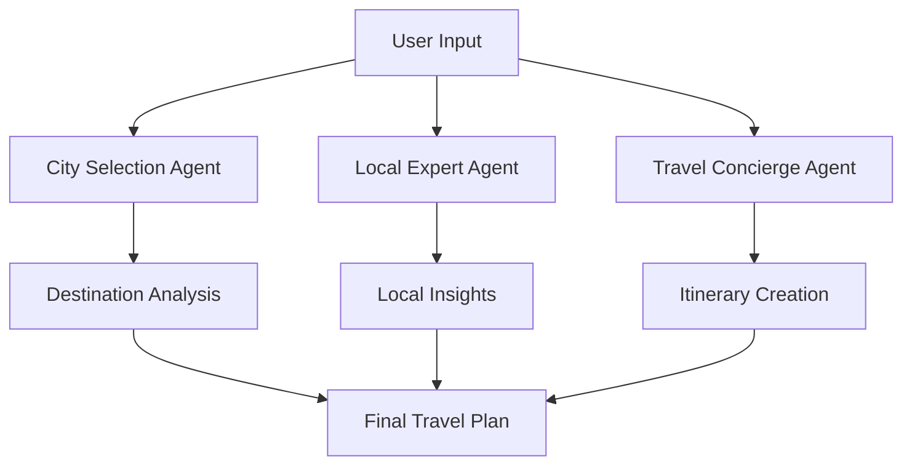

# ✈️ TravAgent - AI-Powered Travel Planning Assistant

<div align="center">
  


**🌟 Transform Your Travel Dreams into Reality with Intelligent AI Agents 🌟**

[](https://streamlit.io/)
[](https://crewai.com/)
[](https://python.org/)
[](https://ai.google.dev/)

</div>

---

## 🌐 **Live Application**

<div align="center">

### **🚀 Try TravAgent Now!**

[](https://travagent.onrender.com/)

**👆 Click above to access the live application**

*No installation required - Start planning your next adventure instantly!*

</div>

---

## 🚀 **Overview**

TravAgent is a cutting-edge AI-powered travel planning application that revolutionizes how you plan your trips. By leveraging a sophisticated multi-agent architecture, TravAgent creates personalized, comprehensive travel itineraries that feel like they were crafted by a team of expert travel consultants.

### 🎯 **What Makes TravAgent Special?**

- **🤖 Multi-Agent AI System**: Three specialized AI agents work collaboratively to deliver exceptional results
- **🎨 Modern UI/UX**: Beautiful, responsive interface with smooth animations and premium styling
- **⚡ Real-time Intelligence**: Live data integration for weather, prices, and local insights
- **🔧 Robust Architecture**: Production-ready code with comprehensive error handling and logging
- **📱 Responsive Design**: Optimized for all devices with mobile-first approach

---

## 🏗️ **Advanced Architecture**

### 🤖 **AI Agent Ecosystem**



#### **🎯 City Selection Expert**
- **Role**: Destination optimization specialist
- **Capabilities**: Weather analysis, price comparison, seasonal suitability assessment
- **Intelligence**: Evaluates multiple factors to recommend optimal destinations

#### **🏛️ Local Expert Agent**
- **Role**: Insider knowledge provider
- **Capabilities**: Cultural insights, hidden gems discovery, safety recommendations
- **Intelligence**: Provides authentic local perspectives and current information

#### **✈️ Travel Concierge Agent**
- **Role**: Comprehensive itinerary architect
- **Capabilities**: Budget planning, activity scheduling, logistics optimization
- **Intelligence**: Creates detailed day-by-day plans with cost breakdowns

---

## 🛠️ **Technology Stack**

### **🔥 Core Technologies**
- **Framework**: Streamlit (Modern web app framework)
- **AI Engine**: CrewAI (Multi-agent orchestration)
- **LLM**: Google Gemini 2.0 Flash (Latest generation AI)
- **Language**: Python 3.8+

### **🔧 Advanced Tools & Integrations**
- **Web Scraping**: Browserless.io API + Unstructured HTML parsing
- **Search Intelligence**: Serper API (Google Search integration)
- **Mathematical Operations**: Safe expression evaluation
- **Data Processing**: Pydantic models for type safety
- **Logging**: Comprehensive error tracking and monitoring

### **🎨 Frontend Excellence**
- **Styling**: Custom CSS with Google Fonts (Poppins)
- **Design System**: Gradient backgrounds, glassmorphism effects
- **Animations**: Smooth transitions and hover effects
- **Responsive**: Mobile-first design principles
- **UX**: Intuitive form handling and status indicators

---

## ⚡ **Key Features**

### 🌟 **Intelligent Planning**
- **Smart Destination Selection**: AI analyzes weather patterns, costs, and seasonal factors
- **Local Intelligence**: Real-time insights from local experts and current events
- **Budget Optimization**: Comprehensive cost breakdowns with money-saving tips
- **Activity Curation**: Personalized recommendations based on user interests

### 🔍 **Advanced Data Integration**
- **Live Weather Data**: Real-time forecasts for travel dates
- **Flight Price Analysis**: Current pricing and booking recommendations
- **Local Events**: Up-to-date information on festivals and attractions
- **Safety Intelligence**: Current advisories and local safety tips

### 📊 **Comprehensive Output**
- **Detailed Itineraries**: Day-by-day schedules with timing optimization
- **Budget Breakdowns**: Transparent cost analysis across all categories
- **Packing Lists**: Smart recommendations based on destination and activities
- **Local Hacks**: Insider tips for authentic experiences

---

## 🚀 **Getting Started**

### **Prerequisites**
```bash
Python 3.8+
Streamlit
CrewAI
Required API Keys (Browserless, Serper)
```

### **Quick Setup**
```bash
# Clone the repository
git clone https://github.com/saurav-sabu/TravAgent.git
cd TravAgent

# Install dependencies
pip install -r requirements.txt

# Set up environment variables
cp .env.example .env
# Add your API keys to .env file

# Launch the application
streamlit run app.py
```

### **Environment Configuration**
```env
BROWSERLESS_API_KEY=your_browserless_key
SERPER_API_KEY=your_serper_key
GEMINI_API_KEY=your_gemini_key
```

---

## 📁 **Project Structure**

```
travagent/
├── 📁 __pycache__/           # Python cache files
├── 📁 streamlit/            # Streamlit configuration files
├── 📁 tools/                # Custom tool implementations
├── 📁 trip/                 # Trip-related modules
├── 🔧 .env                  # Environment variables
├── 🚫 .gitignore           # Git ignore rules
├── 🐍 api_app.py           # API application entry point
├── 🐍 app.py               # Main application file
├── 🐍 cli_app.py           # Command line interface
├── 📄 cli_command.txt      # CLI commands documentation
├── 📝 requirements.txt     # Python dependencies
├── 🤖 trip_agents.py       # AI agent definitions
├── 📊 trip_planner.log     # Application logs
└── 📋 trip_tasks.py        # Task orchestration
```


### **🛠️ Advanced Tools**
- **Browser Tools**: Intelligent web scraping with content summarization
- **Search Tools**: Real-time internet search with result optimization
- **Calculator Tools**: Safe mathematical operations with error handling

---

## 🎭 **User Experience Highlights**

### **🎨 Visual Design**
- Modern gradient backgrounds and glassmorphism effects
- Smooth animations and micro-interactions
- Responsive layout optimized for all screen sizes
- Premium typography with Google Fonts integration

### **🔄 Interactive Elements**
- Real-time status updates during processing
- Progressive disclosure of information
- Intuitive form validation and feedback
- Downloadable travel plans in multiple formats

---

## 🚀 **Deployment & Production**

### **🌐 Streamlit Cloud Deployment**
```bash
# One-click deployment to Streamlit Cloud
streamlit run app.py
```

---

## 🔮 **Future Enhancements**

- **🗺️ Interactive Maps**: Visual itinerary mapping
- **📱 Mobile App**: Native mobile application
- **🌐 Multi-language**: International language support
- **🤝 Social Features**: Trip sharing and collaboration
- **📊 Analytics**: User behavior insights and optimization

---

## 👨‍💻 **About the Developer**

Created with ❤️ by **Saurav Sabu** - A passionate developer focused on creating intelligent, user-centric applications that solve real-world problems.

### **🔗 Connect & Collaborate**
[](https://github.com/saurav-sabu)
[](https://linkedin.com/in/saurav-sabu)
[](saurav.sabu9@gmail.com)

---

## 📄 **License**

This project is licensed under the MIT License - see the [LICENSE](LICENSE) file for details.

---

<div align="center">

**🌟 Star this repository if you found it impressive! 🌟**

*Transforming travel planning with the power of AI*

</div>